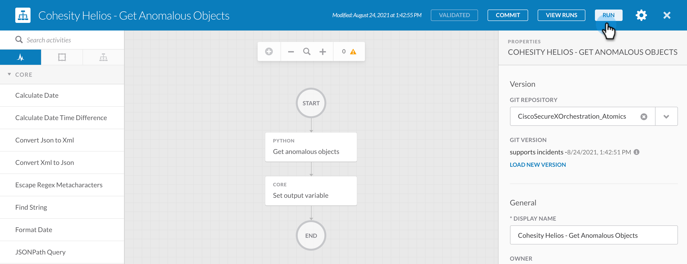
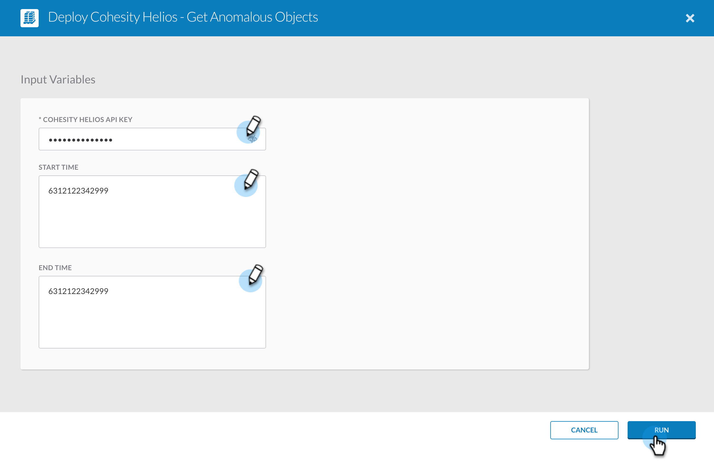

##  Cohesity Helios - Get Anomalous Objects 
[home](../../README.md)

This atomic perform a fetch operation which gets the list of anomalous objects from Cohesity Helios. This atomic action can be used to create your own custom workflow and the output from this Atomic action can be used to perform some action. 

### Input

When you run this Atomic action, it will ask for the following input. 

| **Argument Name** | **Type** | **Description** | **Required** |
| --- | --- |--- | --- |
| Cohesity Helios API Key | Secure String | API Key to access Helios | Yes | 
| Start Time | String | Anomalous Object Alerts created after this time will be fetched. This time is an EPOCH timestamp in microseconds   | No | 
| End Time | String | Anomalous Object Alerts created before this time will be fetched. This time is an EPOCH timestamp in microseconds | No | 

### Output

This Atomic actions gives out the following output that you can use to perform operations like resolving these objects, restoring the anomalous objects etc. 

| **Argument Name** | **Type** | **Description** |
| --- | --- | --- |
| Anomalous Objects Json | String  | The json object (a JSON string) with holds the anomalous objects fetched from Cohesity Helios | 

### How to Run 
[home](../../README.md)

To run the atomics follow these steps. 

1. Login to your SecureX account and go to Orchestration

    

2. Click `Atomic Actions` and click the Atomic action you want to run. 

    

3. Click Run 

    

4. Enter the Input for this atomic and click `Run`

    