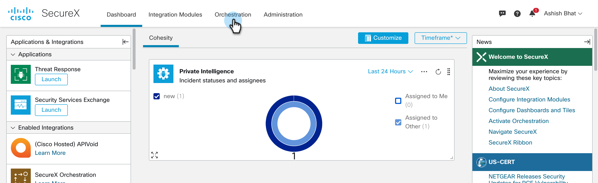
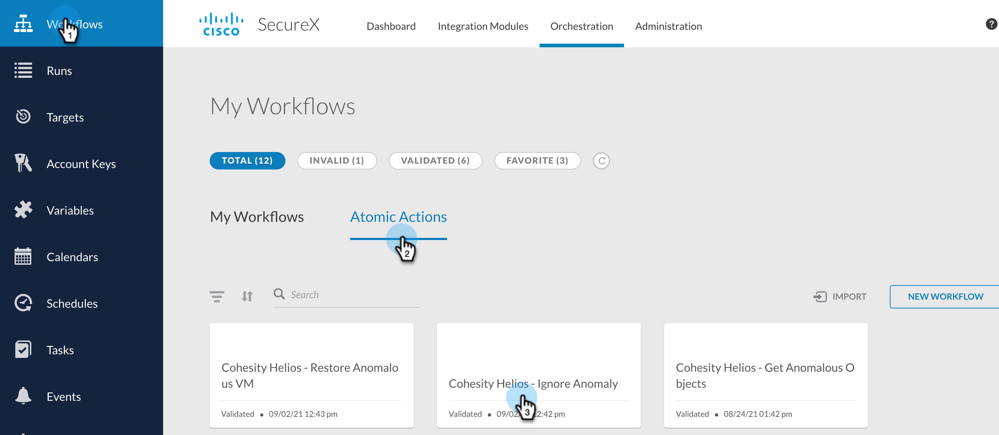
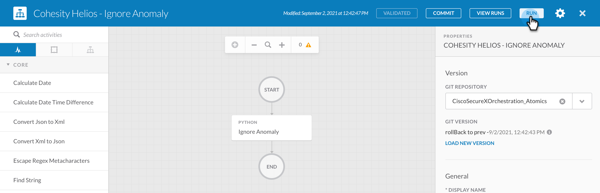
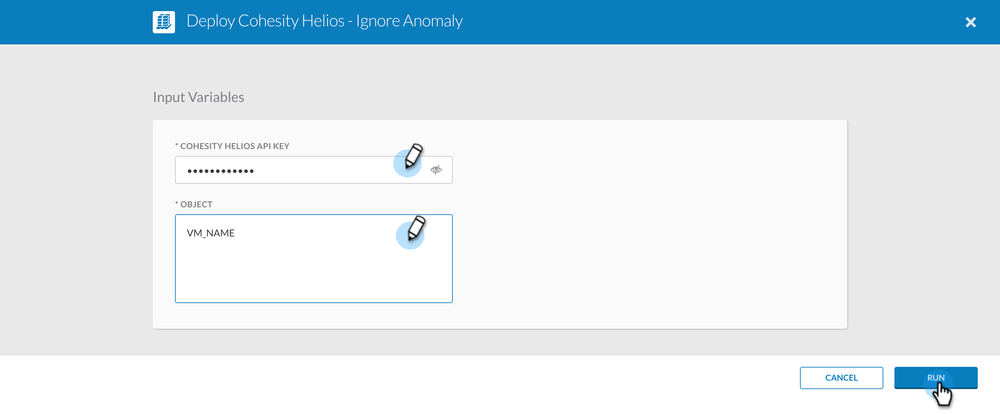

###  Cohesity Helios - Ignore Anomaly
[home](../../README.md)

This Atomic Action ignores the anomaly which removes the anomalous object from the list of anomalous object. This suppresses the anomalous object alert on Cohesity Helios. This atomic action can be used to create your own custom workflow and the output from this Atomic action can be used to perform some action. 

##### Input

| **Argument Name** | **Type** | **Description** | **Required** |
| --- | --- |--- | --- |
| Cohesity Helios API Key | Secure String | API Key to access Helios | Yes | 
| Object | String | The VM Object name that needs to be Ignored   | Yes | 

##### Output

N/A

### How to Run 
[home](../../README.md)

To run the atomics follow these steps. 

1. Login to your SecureX account and go to Orchestration

    

2. Click `Atomic Actions` and click the Atomic action you want to run. 

    

3. Click Run 

    

4. Enter the Input for this atomic and click `Run`

    