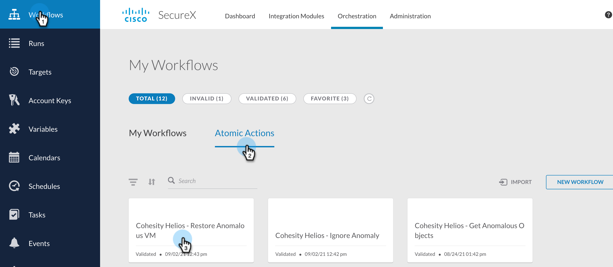
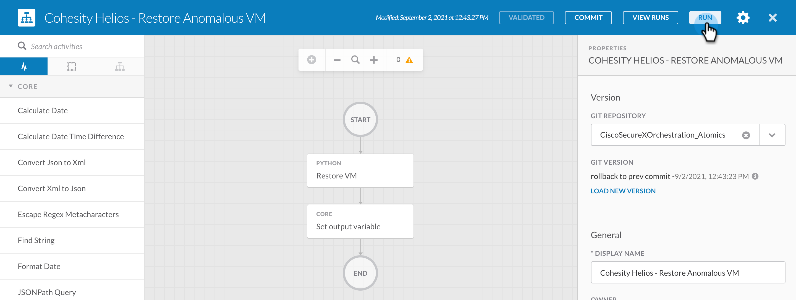
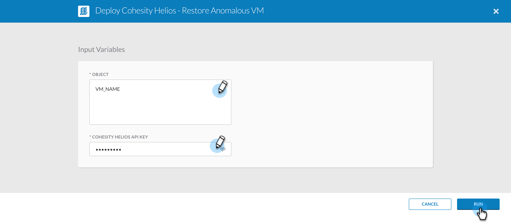

###  Cohesity Helios - Restore Anomalous VM
[home](../../README.md)

This Atomic Action performs a restore operation for the specified anomalous VM to latest clean snapshot. Currently only VMware VMs are supported. This atomic action also resolves the corresponding alert on Helios after restore task for that vm is triggered. This atomic action can be used to create your own custom workflow and the output from this Atomic action can be used to perform some action. 

##### Input

| **Argument Name** | **Type** | **Description** | **Required** |
| --- | --- |--- | --- |
| Cohesity Helios API Key | Secure String | API Key to access Helios | Yes | 
| Object | String | The name of the VM that needs to be restored   | Yes | 

##### Output

| **Argument Name** | **Type** | **Description** |
| --- | --- | --- |
| Restored Object  | String  | The name of the VM that was restored to the latest snapshot | 

### How to Run 
[home](../../README.md)

To run the atomics follow these steps. 

1. Login to your SecureX account and go to Orchestration

    

2. Click `Atomic Actions` and click the Atomic action you want to run. 

    

3. Click Run 

    

4. Enter the Input for this atomic and click `Run`

    