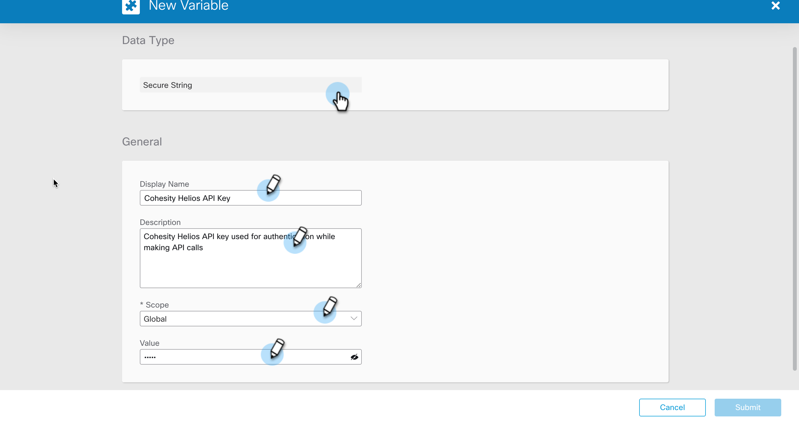

### Set Global Variable for Helios API key

In this document, we will go over the steps to Set a Global Variables which will be used by SecureX Workflows. Let's dive into the steps. 

1. Login to your SecureX account and go to Orchestration

    

1. From Orchestration, navigate to Variables from left Nav bar and click `New Variable` under `Global Variables`.

    

2. Select the `Data Type`, enter a `DISPLAY NAME` and give it a meaningful `DESCRIPTION`. Select the `SCOPE` of the variable as `Global`

    

