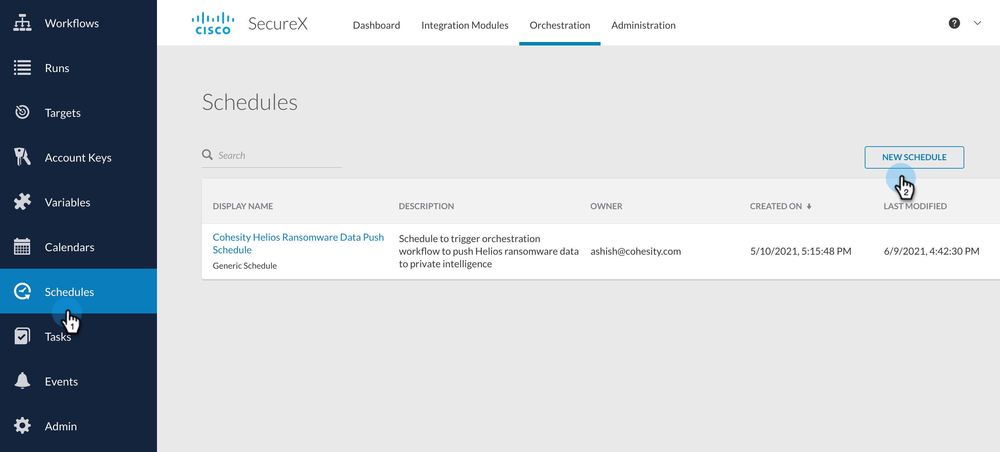
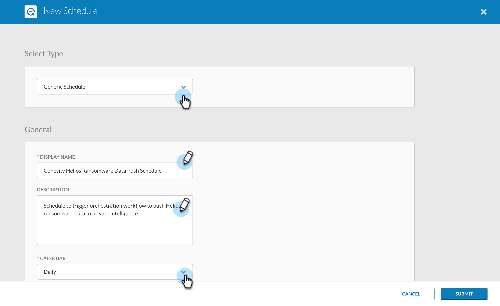
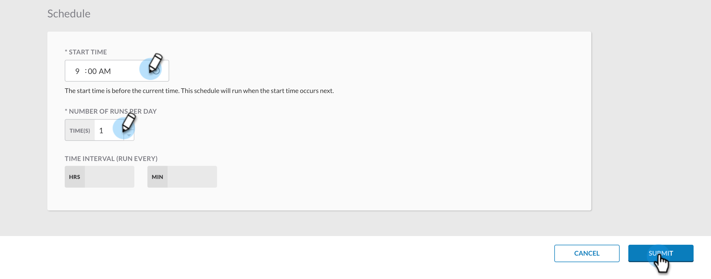

###  Create Schedule on SecureX

In this document, we will go over the steps to create a Schedule on SecureX to run the [Cohesity Helios Ransomware Alerts to Threat Response and ServiceNow](../workflows/HeliosRansomwareAlertsToThreatResponseAndServiceNow.md) workflow. Let's dive into the steps. 

>NOTE: If you want to learn SecureX Schedule in more details, visit [SecureX Documentation on Schedule](https://ciscosecurity-sx-00-integration-workflows.readthedocs-hosted.com/en/latest/orchestration/schedules.html). 

1. Login to your SecureX account and go to Orchestration

    

2. Navigate to Schedules from the left nav bar

3. Click on `New Schedule`

    

4. Select the `Type` as `Generic Schedule`. 

5. The `DISPLAY NAME` MUST be `Cohesity Helios Ransomware Data Push Schedule` as the [Cohesity Helios Ransomware Alerts to Threat Response and ServiceNow](../workflows/HeliosRansomwareAlertsToThreatResponseAndServiceNow.md) workflow uses a trigger which looks for this Schedule. 

6. Give it a meaningful description. 

7. Set the `CALENDAR` and `TIMEZONE` 

    

8. Scroll down and set the `SCHEDULE` for this where you will define parameters like what time it will run and how many runs per day and other details. Refer the screenshot for more details. 

    