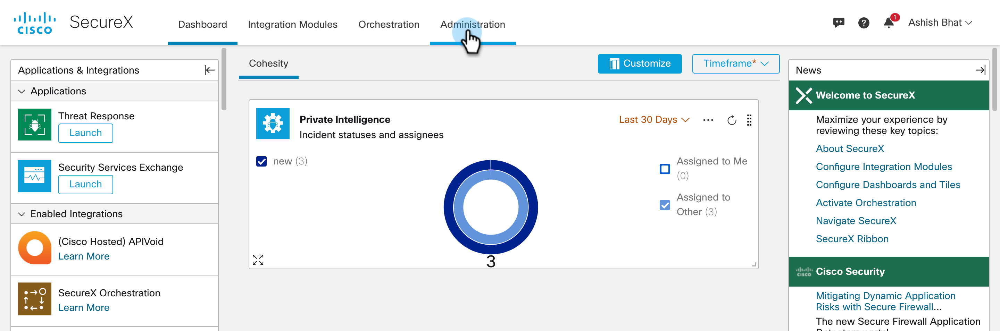
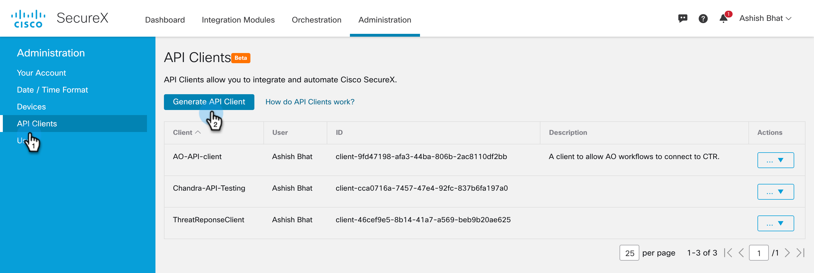
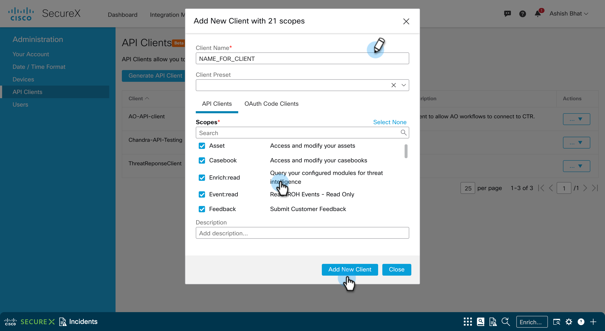
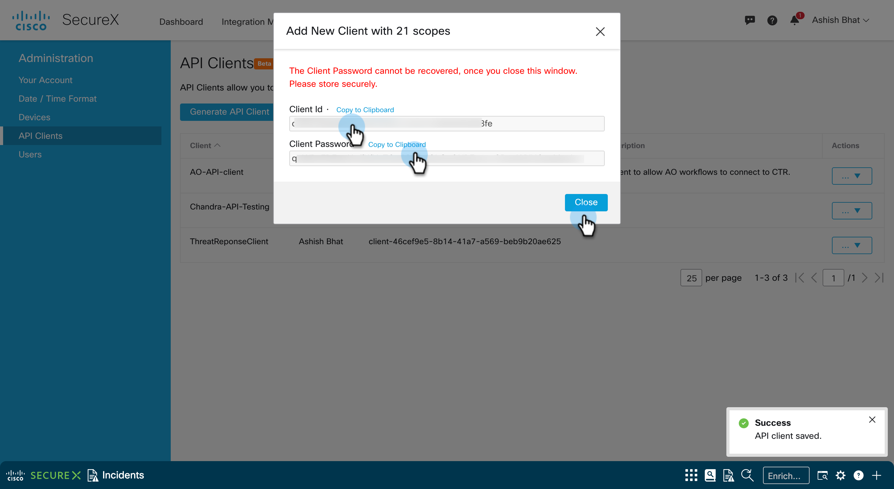

## Create SecureX API Client

In this document, we will go over the steps to create SecureX API Client and Password that you will need to run all workflows. 

1. Login to your SecureX account and go to Administration

    

2. Select `API Client` from left Nav bar and click on `Generate API Client`

    

3. Enter a `Client Name` and give the required permissions for this Client and click on `Add New Client`

    

4. You will see a dialog where you should see the Client ID and Client Password. Copy and save it securely. 
    
    