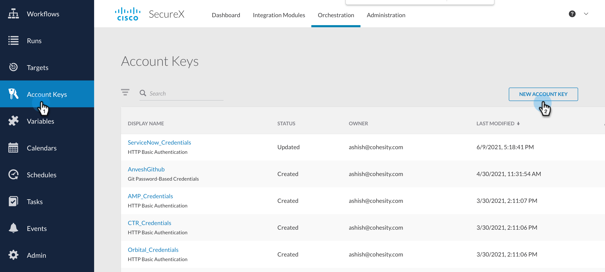
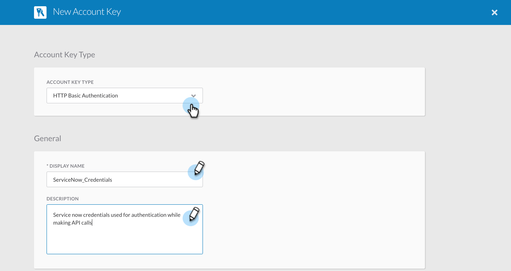
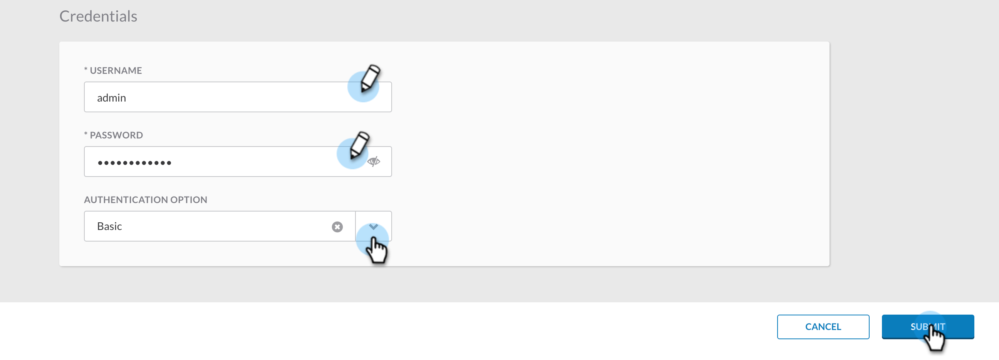

### Create ServiceNow Credentials

In this document, we will go over the steps to create ServiceNow credentials that will be needed to create ServiceNow tickets for the SecureX incident that gets created after you run [Cohesity Helios Ransomware Alerts to Threat Response and ServiceNow](../workflows/HeliosRansomwareAlertsToThreatResponseAndServiceNow.md) workflow.

1. Login to your SecureX account and go to Orchestration

    

2. Navigate to `Account Keys` from the left nav bar and Click on `NEW ACCOUNT KEY`

    

3. Under `ACCOUNT KEY TYPE` select `HTTP BASIC AUTHENTICATION`. 

4. The `DISPLAY NAME` MUST be `ServiceNow_Credentials` as the [Cohesity Helios Ransomware Alerts to Threat Response and ServiceNow](../workflows/HeliosRansomwareAlertsToThreatResponseAndServiceNow.md) workflow uses a Target which looks for this Credentials. Give it a meaningful description. 

    

5. Under Credentials set the `USERNAME`, `PASSWORD` and `AUTHENTICATION OPTION` and click `Submit`.

    

