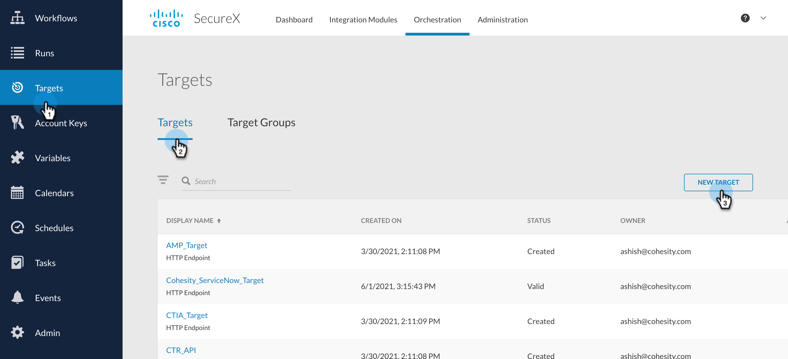
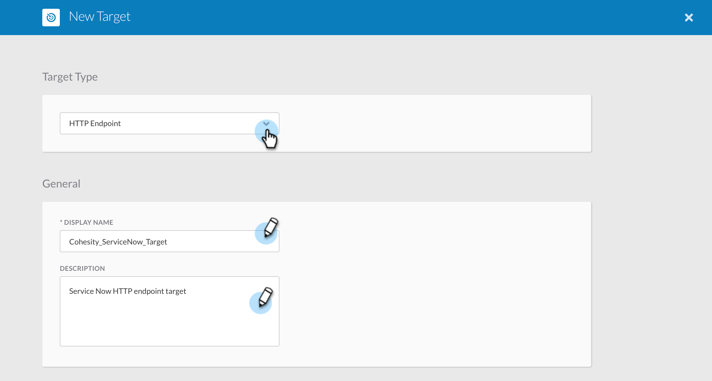
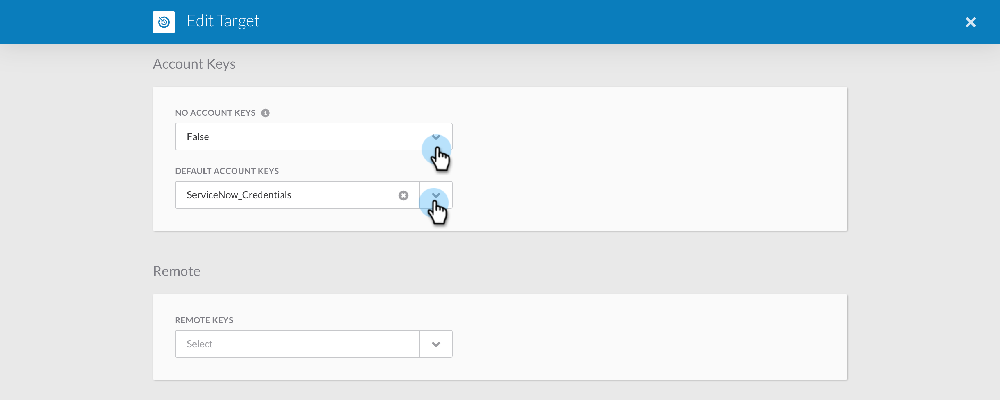
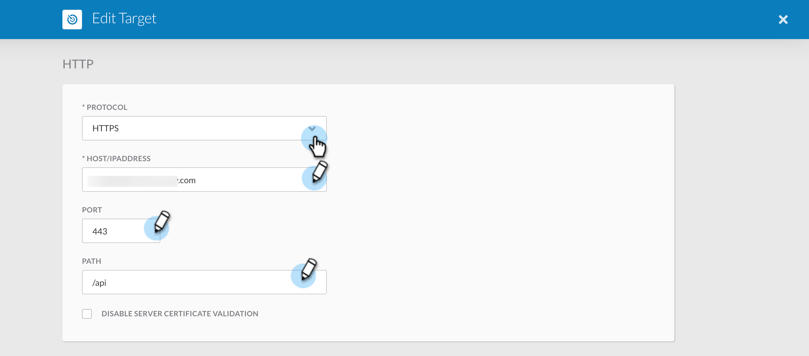
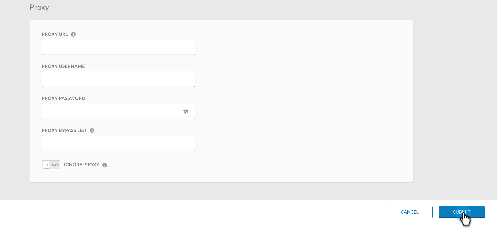

### Create ServiceNow Target

In this document, we will go over the steps to create ServiceNow Target that will be used by [Cohesity Helios Ransomware Alerts to Threat Response and ServiceNow](../workflows/HeliosRansomwareAlertsToThreatResponse.md) workflow.

1. Login to your SecureX account and go to Orchestration

    

2. Navigate to `Targets` from the left nav bar and Click on `NEW TARGET`

    

3. Under `Target Type` select `HTTP ENDPOINT`. 

4. Under `General` section, The `DISPLAY NAME` MUST be `Cohesity_ServiceNow_Target` as the [Cohesity Helios Ransomware Alerts to Threat Response and ServiceNow](../workflows/HeliosRansomwareAlertsToThreatResponse.md) workflow uses this. Give it a meaningful description. 

    

5. Under `Account Keys` set the `DEFAULT ACCOUNT KEYS` with the [ServiceNow credentials](./CreateServiceNowCredentials.md) that you created earlier. 

    

6. Scroll down to `HTTP` section and enter your ServiceNow details as shown. 

    

7. You can leave rest of the fields empty. Now click on `SUBMIT` to create this Target. 

    

