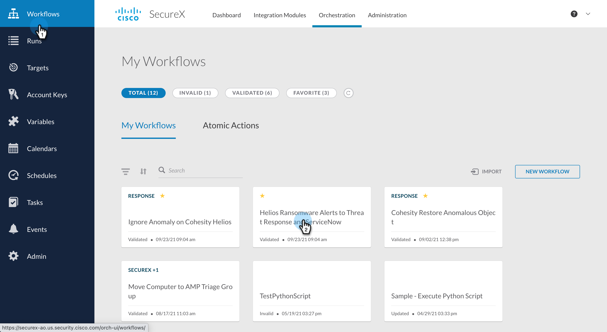
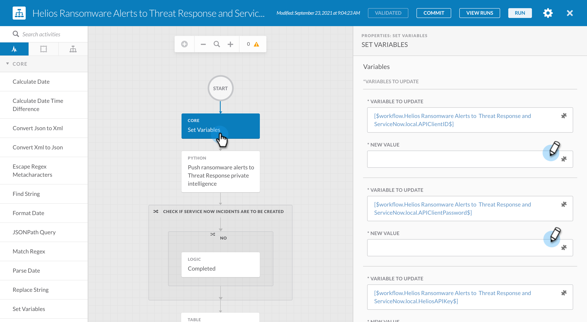
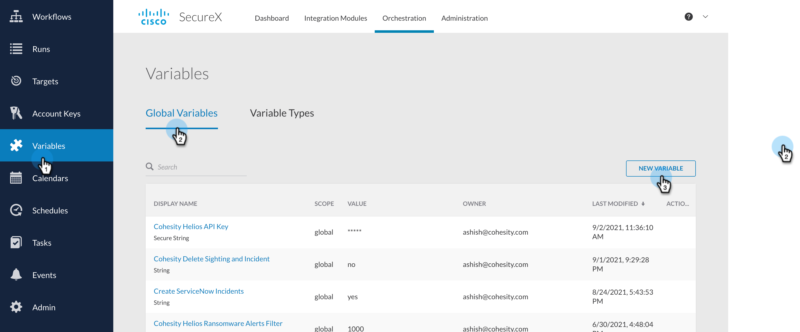
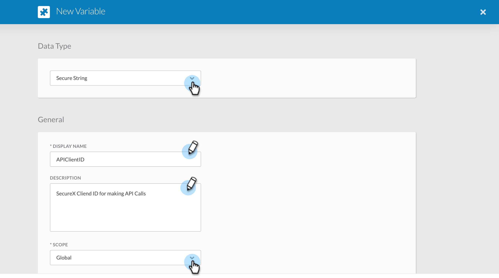
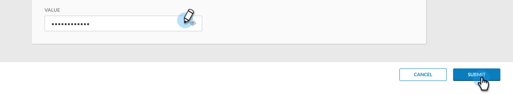
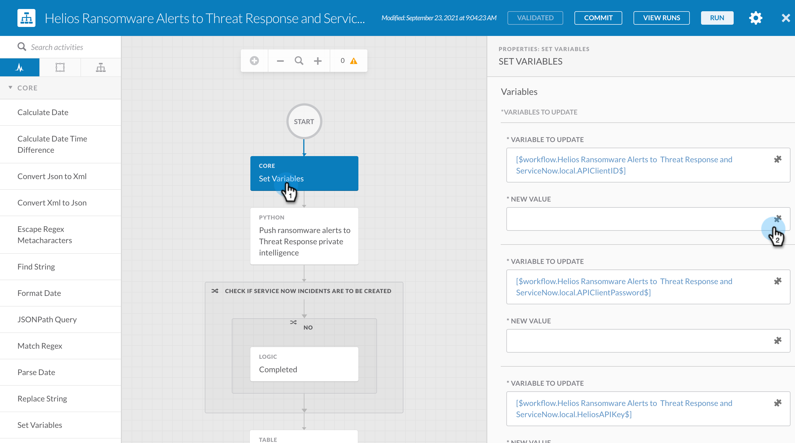
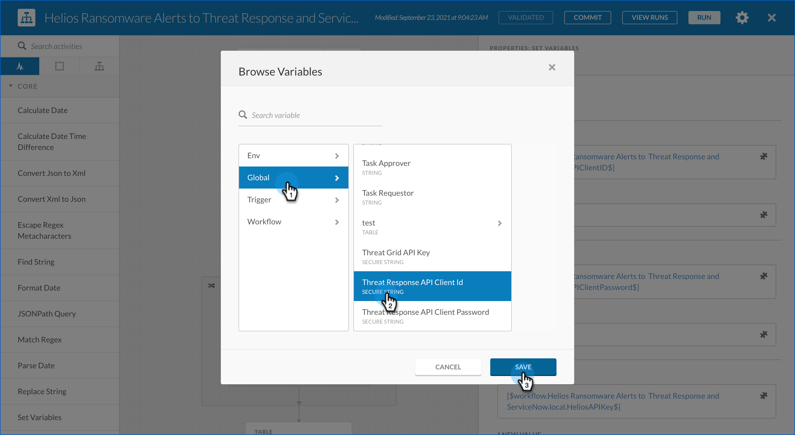

### Set Variables To Run Workflows

In this document, we will go over the steps to Set Variables which will be used by SecureX Workflows. Let's dive into the steps. 

>NOTE:  All of the steps documented below will be run after the Workflow have been imported into SecureX. 

1. Login to your SecureX account and go to Orchestration

    

2. Navigate to Workflows from the left nav bar and open the workflow where you want to set the variables

    

4. Click on the Set Variable Activity on the workflow canvas. On the right side, you can enter values for all the variables present there. 

    

### Set Variables using Global Variables

Now if you don't want to hard code these variables, there is another way you can pass these variables. Lets look into that. 

1. From Orchestration, navigate to Variables from left Nav bar and click `New Variable` under `Global Variables`.

    

2. Select the `Data Type`, enter a `DISPLAY NAME` and give it a meaningful `DESCRIPTION`. Select the `SCOPE` of the variable as `Global`

    

>NOTE: You will have use `Data Type` as `Secure String` for variables like `APIClientID`, `APIClientPassword` and `HeliosAPIKey`. 

3. Enter a value for this variable and click `Submit`

    

#### Reference these global variables in Workflow

Now that you have created these global variables, you can now go back to the Workflow and open the `Set Variable` activity and reference these global variables as show below. 

1. Navigate to Workflows from the left nav bar and open the workflow where you want to set the variables

    

2. Click on the Set Variable Activity on the workflow canvas. On the right side, you can reference the global variables as shown in the screen

    

    

4. You can perform this for all the variables for which you have created Global variables. 