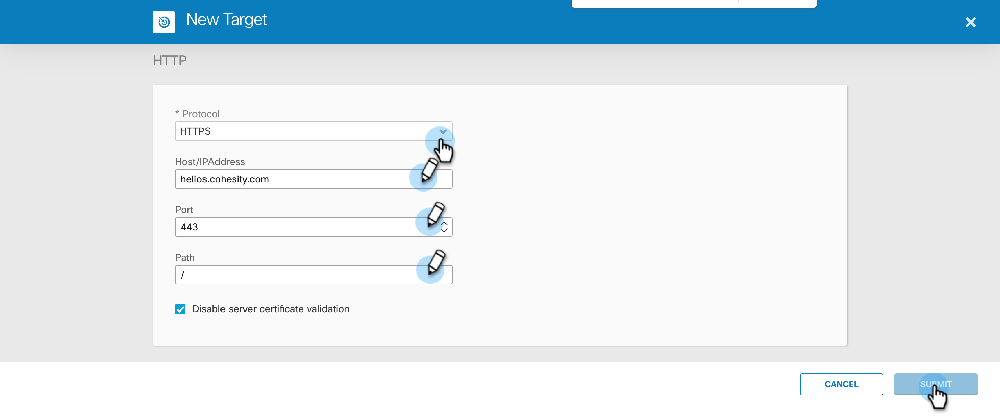

### Create Cohesity Helios Target

In this document, we will go over the steps to create Cohesity Helios Target that will be used by all [Cohesity workflows](../../workflows).

1. Login to your SecureX account and go to Orchestration

    

2. Navigate to `Targets` from the left nav bar and Click on `NEW TARGET`

    

3. Under `Target Type` select `HTTP ENDPOINT`. 

4. Under `General` section, The `DISPLAY NAME` MUST be `Cohesity Helios` as all the workflow uses this. Give it a meaningful description. 

    

5. Leave `Account Keys` and `Remote` section as it is. 

    

6. Scroll down to `HTTP` section and enter your Cohesity Helios details as shown and click on `Submit`. 

    

