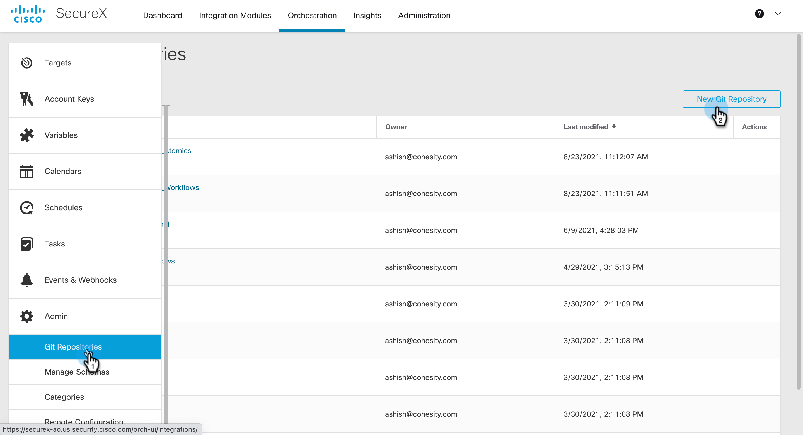
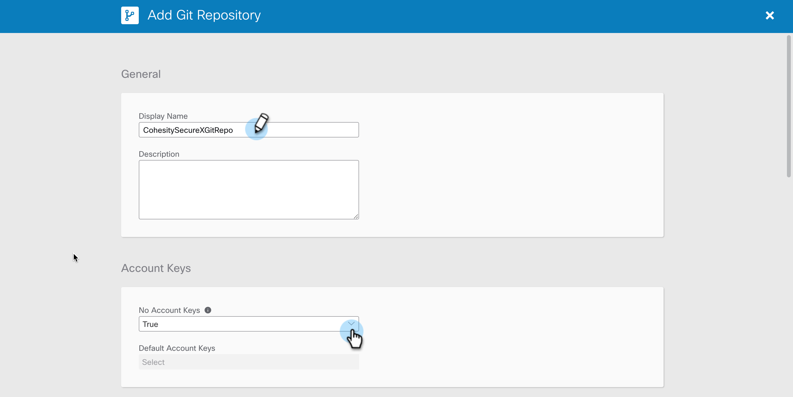
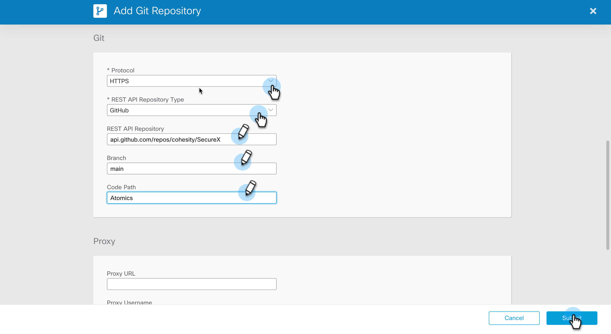
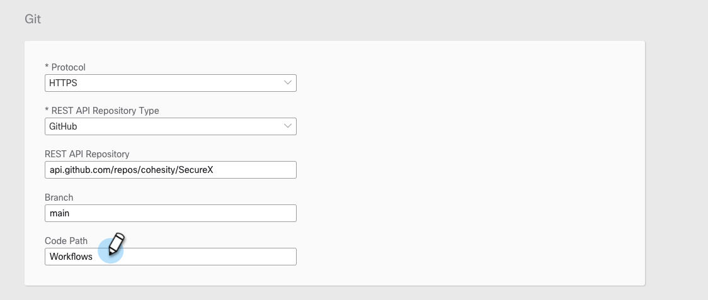

### Create ServiceNow Target

In this document, we will go over the steps to register this Cohesity SecureX Repo on SecureX. You can then import Atomics and Workflows from this repo to your SecureX account. 

## Register Atomics from Cohesity Repo

1. Login to your SecureX account and go to Orchestration

    

2. Navigate to `Admin` from the left nav bar and Click on `Git Repositories` and click on `New Git Repository` 

    

3. Enter a `Display Name` and under `Account Keys` choose `True`. 

    

4. Under Git, enter the Git Repo name and branch name in the format shown in the screenshot. 

> Note that the Code Path is case sensistive

5. You can leave rest of the fields empty. Now click on `SUBMIT` to create this Target. 

    
    

## Register Workflows from Cohesity Repo

1. The Steps are the same as above but instead of `Atomics`, you will use `Workflows` under Code Path as shown in screenshot shown below. 

    