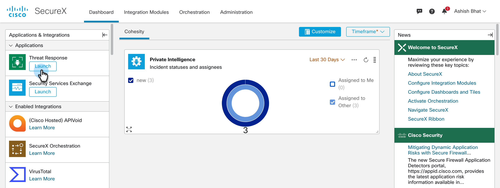
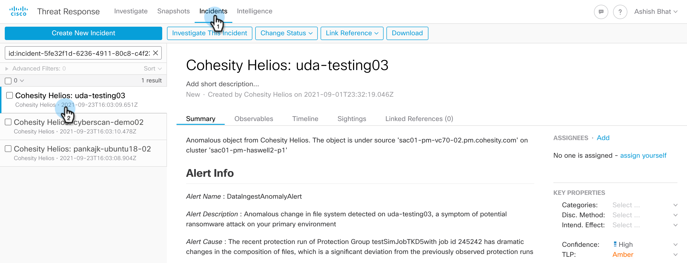
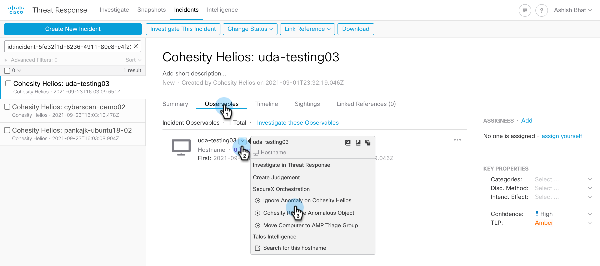

## Table of contents :scroll:

 - [Intro](#intro)
 - [Pre-requisites](#pre-req)
    * [Set Variables](#set-variables)
 - [How to Run](#run)
 - [Input to this workflow](#input)
 - [Output for workflow](#output)
 - [What's Next!](#next)

###  Ignore Anomaly on Cohesity Helios
[home](../../README.md)

This workflow ignores anomaly for the specified object on Helios which removes this object from the list of anomalous objects. This workflow also suppresses anomalous object alert on helios of the given object. This workflows also Resolves the SecureX Incident and Sighting or deletes them, based on the `DeleteSightingIncident` variable set in this workflow. 

> NOTE: This is an Response workflow and you will NOT run this workflow directly. This will run from Cisco Threat Response under incident. Please check the [How to Run section](#run) to know more. 

###  Pre-requisites

Before you can run this workflow, there are a certain pre-req that you need to configure. Lets go over all of them and make sure they are set to get started. Most of the steps are common between all the workflows, so once you set configure these, you will be able to easily configure and run other workflows :)

####  Set Variables

This workflow expects a bunch of variables that are needed to make a bunch of API calls like getting anomalous objects from Cohesity Helios and suppressing the alert on Helios and resolve the Incident on SecureX. These variables should be set for before you try and run this workflow. Below is the list of variables that you need to set with their description.  

| **Argument Name** | **Type** | **Description** | **Required** |
| --- | --- |--- | --- |
| APIClientID | Secure String | Threat Response API Client ID | Yes | 
| APIClientPassword | Secure String | Threat Response API Client Password | Yes | 
| HeliosAPIKey | Secure String | API Key to access Helios | Yes | 
| DeleteSightingIncident  | String | Specifies where to delete or not the sighting once the anomaly is ignored. Can be `yes` or `no`.| No. Default is `No` | 

In order to set this variables, check the [Set Variables document](../misc/SetVariables.md). 

>NOTE: There are other 2 variable that this workflow uses named `observable_value` and `observable_type` but that is set directly when you [run](#run) the workflow.  

###  How to Run
[home](../../README.md)

Once you have performed all the [pre-req](#pre-req) for this workflow, this workflow can be executed from Threat Response for the Incident there shown below. 

> NOTE: You will need to run the [Cohesity Helios Ransomware Alerts to Threat Response and ServiceNow](./HeliosRansomwareAlertsToThreatResponseAndServiceNow.md) workflow to see the SecureX incident for Cohesity Helios Anomalous object alert.

1. Login to SecureX and navigate to Threat Response

    

2. Navigate to Incident and select the Incident for Cohesity Helios Anomalous object. 

    

3. Under Observable, click the dropdown for the hostname and select `Ignore Anomaly on Cohesity Helios`

    

4. This will trigger the `Ignore Anomaly on Cohesity Helios` workflow and pass the `observable_value` and `observable_type` to the workflow as the `VM_NAME_VALUE` and `string` respectively. 

>NOTE: You will see the `Ignore Anomaly on Cohesity Helios` on other Incidents too but you cannot run it there as it will fail for Incidents that are not created by Cohesity workflows. 

###   Input

Input to these workflows can be referred to under [Set Variables](#set-variables) section

###   Output

N/A

###  What's Next!
[home](../../README.md)

After you have executed this workflow, the anomalous objects reported by Cohesity Helios will be pushed into SecureX Threat Response as Incidents and you can perform 2 operations on these Incidents. They are,

1. [Restore to Object to latest known safe snapshot](./CohesityRestoreAnomalousObject.md)